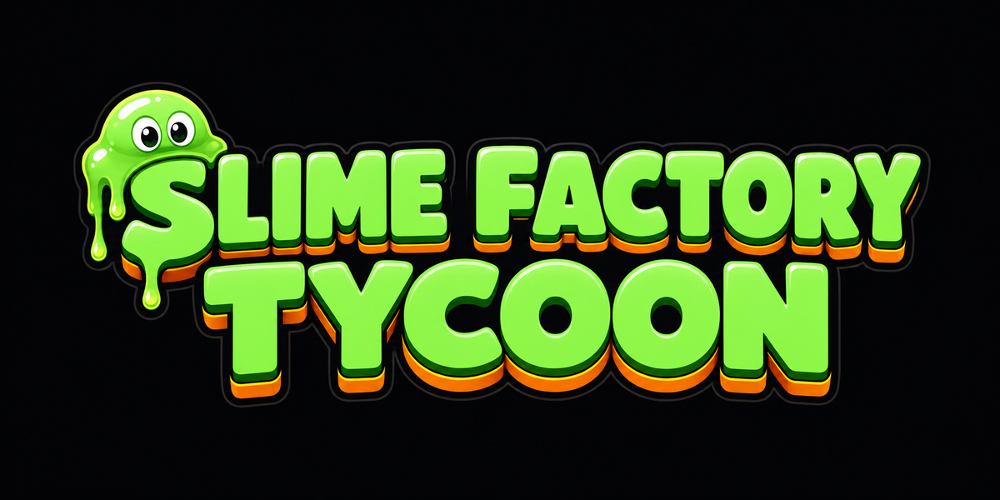
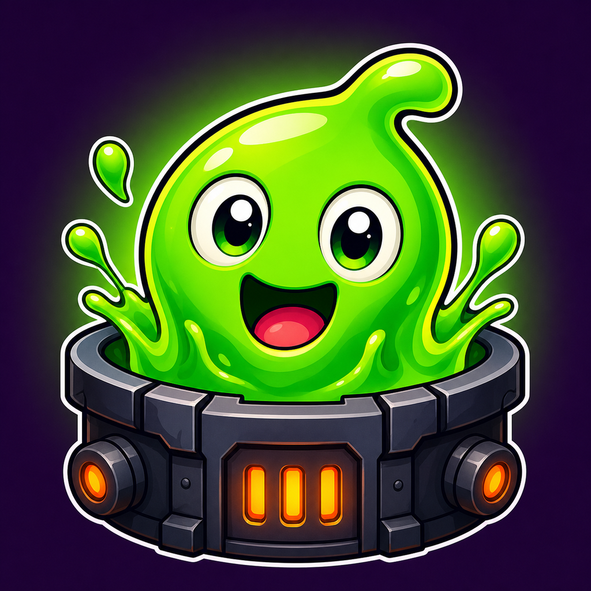

# Brand Guidelines

The visual identity is defined once in [`src/shared/Theme.luau`](src/shared/Theme.luau) and mirrored in [`game.manifest.json`](game.manifest.json), so the Roblox client and the website can never drift apart.

---

## Concept

**Industrial neon.** Deep violet-black machinery lit by radioactive green goo, with amber as the reward accent.

The idea is a grimy underground factory that's been taken over by something cheerful and alive. The machinery is hard-edged, dark, and mechanical; the slime is soft, glossy, and friendly. That contrast is the whole identity — every asset should have both.

**Colour semantics are strict.** Players learn them in the first minute and rely on them forever:

| Colour | Always means |
|---|---|
| 🟢 Green | Income, growth, "you gained something" |
| 🟠 Amber | Value, premium, rewards, prestige |
| 🟣 Violet | The world, surfaces, neutral chrome |
| 🔴 Red | Locked, error, destructive |

Never use green for a warning or amber for a failure. Consistency here does more for readability than any amount of polish.

---

## Palette

### Surfaces
| Token | Hex | Use |
|---|---|---|
| `void` | `#0E0A18` | Deepest background, modal scrims |
| `bg` | `#181228` | Page background, card interiors |
| `surface` | `#261E3C` | Panels, raised containers |
| `surfaceHi` | `#342A4E` | Buttons, interactive surfaces |
| `line` | `#483C68` | Borders, dividers, scrollbars |

### Brand
| Token | Hex | Use |
|---|---|---|
| `slime` | `#78FF78` | Primary brand, income, CTAs |
| `slimeDeep` | `#40C854` | Pressed states, shadows |
| `slimeGlow` | `#B4FFAA` | Highlights, glow passes |
| `amber` | `#FF9628` | Rewards, prestige, premium |
| `amberGlow` | `#FFC86E` | Amber highlights |
| `violet` | `#9664FF` | Secondary accent |

### Text
| Token | Hex | Use |
|---|---|---|
| `text` | `#FFFFFF` | Primary |
| `textDim` | `#AAA5BE` | Secondary, captions |
| `textFaint` | `#78748C` | Disabled, placeholders |

### Rarity
`Common #B4B4BE` · `Uncommon #6EDC82` · `Rare #4696FF` · `Epic #B45AFF` · `Legendary #FFBE3C` · `Mythic #FF508C`

---

## Typography

In-game uses Roblox's built-in Gotham family — no font uploads, no load cost.

| Role | Font | Size |
|---|---|---|
| Display / logo | Gotham Black | 42 |
| Titles | Gotham Bold | 28 |
| Headings | Gotham Bold | 22 |
| Body | Gotham | 17 |
| Small | Gotham | 15 |
| Minimum | Gotham | **13 — never smaller** |

On the web, use the system UI stack (`-apple-system, Segoe UI, Roboto`) — visually close to Gotham, zero download.

**Rule:** the number that shows a player's income is always the largest text on screen. It's the thing they came to watch go up.

---

## Logo

- **Clear space:** at least the height of the "S" on every side.
- **Minimum width:** 240px. Below that use the icon instead.
- **Do:** place on `void` or `bg`, or over a dark photo with a scrim.
- **Don't:** recolour it, add a drop shadow, stretch it, or place it on light backgrounds or busy imagery.

## Icon

One character, one action, no text. Roblox icons are viewed at ~150px in the wild and ~50px in search — if it isn't readable as a thumbnail it isn't working.

Sizes shipped: `icon.png` (1024) · `icon-512.png` · `icon-256.png` · `icon-128.png` · `icon.webp`

## Banner

16:8. Wordmark left, character right, negative space in the middle so text overlays remain legible. Used for the GitHub header, the site's game page, and social cards.

---

## Asset inventory

| File | Dimensions | Size | Purpose |
|---|---|---|---|
| `banner.png` | 1600×800 | 1.3 MB | GitHub header, print-quality source |
| `banner.webp` | 1600×800 | 97 KB | Web delivery |
| `logo.png` | 1200×600 | 589 KB | Wordmark lockup |
| `logo.webp` | 1000×500 | 38 KB | Web delivery |
| `icon.png` | 1024×1024 | 1.4 MB | Master icon |
| `icon-512.png` | 512×512 | 376 KB | **Roblox experience icon** |
| `icon-256.png` | 256×256 | 105 KB | Web / PWA |
| `icon-128.png` | 128×128 | 31 KB | Favicon, small UI |
| `icon.webp` | 512×512 | 38 KB | Web delivery |

Always serve `.webp` on the web with the `.png` as a `<picture>` fallback. The banner alone is a 1.3 MB → 97 KB saving.

---

## Motion

| Token | Duration | Easing | Use |
|---|---|---|---|
| `instant` | 80 ms | Quad Out | Button press |
| `fast` | 160 ms | Quad Out | Hover, small state |
| `normal` | 260 ms | Quad Out | Panels, bars |
| `slow` | 450 ms | Quad Out | Scene changes |
| `pop` | 280 ms | Back Out | Rewards, modals |
| `settle` | 500 ms | Elastic Out | Big celebrations only |

**Every animation must respect Reduced Motion.** `UI.tween()` collapses to an instant property set when it's enabled — that's automatic, not something each caller remembers.

Use `settle` sparingly. Elastic easing on routine interactions feels cheap; save it for legendary hatches and rebirths.

---

## Accessibility

These are requirements, not enhancements:

- **Contrast:** body text ≥ 4.5:1 against its surface. `textDim` on `surface` passes; `textFaint` is decorative only and must never carry meaning alone.
- **Touch targets:** 44×44 px minimum, enforced in `UI.button`.
- **Colour independence:** rarity is shown by border colour *and* a text label. Never colour alone.
- **Reduced motion, high contrast, text scale (80–150%), and colour-blind modes** are all first-class settings that persist server-side and follow the player across devices.

---

## Voice

Short, warm, direct. Never manipulative.

- ✅ "You earned 2.4M Goo while away."
- ❌ "OMG!!! INSANE REWARDS WAITING!!! CLAIM NOW!!!"
- ✅ "Not enough crystals."
- ❌ "You need MORE crystals — buy now to keep your streak alive!"

No fake urgency, no invented scarcity, no guilt. If an offer has a timer, the timer is real and server-authoritative.
