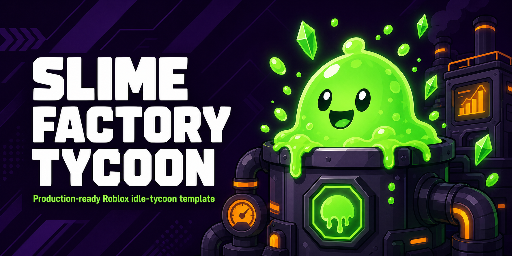

<div align="center">



# Slime Factory Tycoon

**A production-ready, open-source Roblox idle-tycoon template — built for beginners, hardened like a live game.**

[](https://github.com/LIN4CRE/slime-factory-tycoon/actions/workflows/ci.yml)
[](LICENSE)
[](https://luau-lang.org/)
[](https://rojo.space/)
[](STRATEGY.md)
[](STRATEGY.md)

</div>

---

## What this is

A complete, working Roblox game — not a tutorial, not a snippet collection. Tap the vat, earn Goo, buy upgrades, unlock zones, rebirth for permanent multipliers, hatch pets, come back tomorrow for the daily reward.

It's the **idle/incremental** genre, chosen deliberately: it has the best revenue-per-hour-of-work ratio on Roblox for a solo developer, because your content pipeline is a spreadsheet rather than a 3D modelling project. Adding a new zone is one row in a config file. That's what lets you ship weekly, and shipping weekly is what the algorithm rewards.

> **Read [`STRATEGY.md`](STRATEGY.md) first.** It explains why this genre, what the competition looks like, and where the money actually comes from — before you write a line of code.

---

## Highlights

| | |
|---|---|
| **Server-authoritative everything** | The client sends *intent* ("I tapped 5 times"), never *value*. Exploiters gain nothing. |
| **Session-locked DataStores** | Atomic `UpdateAsync` locking kills the #1 cause of item duplication. |
| **Idempotent receipts** | `ProcessReceipt` keyed by `PurchaseId`, saved before confirming. No double-grants, no charged-for-nothing. |
| **UI built entirely in code** | Zero manual GUI dragging. Mobile-first, thumb-zone layout, one `UIScale` for every device. |
| **Automated balance testing** | A Python simulator plays the game in CI and fails the build if progression drifts into churn territory. |
| **One-file content pipeline** | Zones, pets, upgrades, prices, odds — all in `GameConfig.luau`. A weekly update is ~15 minutes. |
| **Rojo-native** | `rojo serve` and your editor syncs live into Studio. No copy-pasting. |

---

## Quick start

### Option A — Rojo (recommended, fully automated)

```bash
git clone https://github.com/LIN4CRE/slime-factory-tycoon.git
cd slime-factory-tycoon

# installs rojo, selene, stylua at pinned versions
aftman install          # or: rokit install

# generate a .rbxlx you can just open in Studio
rojo build default.project.json --output game.rbxlx

# ...or live-sync while you edit
rojo serve
```

Then in Studio: install the **Rojo plugin**, click *Connect*. Every file you save appears in Studio instantly.

### Option B — manual paste

No tooling required. Follow [`SETUP.md`](SETUP.md) — it lists the exact Explorer tree and which file goes into which object.

### Then, before you publish

1. Game Settings → Security → **enable Studio Access to API Services** (DataStores fail silently without it).
2. Create your gamepasses and dev products on the Creator Dashboard.
3. Paste the IDs into `GameConfig.luau`, replacing every `id = 0`. *Anything left at `0` is safely skipped, so you can launch with a partial set.*
4. Work through the checklist in [`LAUNCH.md`](LAUNCH.md).

---

## Repository layout

```
slime-factory-tycoon/
├── src/
│   ├── shared/                    → ReplicatedStorage/Modules
│   │   ├── GameConfig.luau        ★ ALL game design lives here
│   │   └── Format.luau              number abbreviation (1.2K / 3.4M / 5.6aa)
│   ├── server/                    → ServerScriptService
│   │   ├── Bootstrap.server.luau    the only Script; creates remotes, wires services
│   │   └── Services/
│   │       ├── DataManager.luau         session-locked saves, autosave, BindToClose
│   │       ├── EconomyService.luau      authoritative income, clicks, upgrades, anti-cheat
│   │       ├── MonetizationService.luau gamepasses + idempotent ProcessReceipt
│   │       ├── PetService.luau          server-side hatch RNG, published odds
│   │       ├── DailyRewardService.luau  7-day streak
│   │       ├── LeaderboardService.luau  OrderedDataStore, throttled
│   │       └── CodeService.luau         promo codes
│   └── client/                    → StarterPlayer/StarterPlayerScripts
│       ├── ClientMain.client.luau   input, prediction, batched remotes
│       └── UIBuilder.luau           builds the whole interface in code
├── tools/
│   └── balance_sim.py             progression simulator (runs in CI)
├── .github/workflows/ci.yml       lint · balance check · rojo build
├── default.project.json           Rojo mapping
└── docs → STRATEGY · SETUP · SECURITY · OPTIMISATION · LAUNCH
```

---

## The balance simulator

The part I'm most glad exists. It parses `GameConfig.luau` directly — no duplicated numbers — simulates a player, and reports where they'd get stuck.

```bash
$ python3 tools/balance_sim.py --hours 6
==============================================================
  BALANCE SIM  --  6.0h session, 3.0 taps/s, 1.0x mult
==============================================================
  parsed: 5 upgrades, 6 zones
  rebirths reached : 4
  lifetime goo     : 298.69M
  final zone       : Neon Labs
  longest stall    : 2.9 min

  timeline:
        1.38 min   Unlocked Goo Refinery
       11.47 min   Unlocked Toxic Caverns
       21.78 min   Rebirth #1
       56.23 min   Rebirth #2
       77.73 min   Unlocked Neon Labs
      114.52 min   Rebirth #3

  with 2x Goo gamepass:
    rebirths 4 -> 5
    first rebirth 21.8 min -> 10.8 min  (2.01x faster)
    ^ this is your gamepass sales pitch, in numbers

  balance within target ranges.
```

It caught a real bug during development: the original rebirth cost put the first prestige at **33 minutes**, well past where most players quit. Halving it moved it to 22 minutes. That's a retention fix found in a second, without shipping anything.

CI runs `--check`, which exits non-zero if you push a config change that breaks these targets:

- Zone 2 reached in **under 5 minutes** (onboarding)
- First rebirth between **8 and 30 minutes** (meaningful, but reachable)
- No progression stall longer than **45 minutes** (churn wall)

---

## Monetization, in brief

Full reasoning — including *why players actually buy each item* — is in [`STRATEGY.md`](STRATEGY.md).

**Gamepasses:** 2x Goo (199) · Auto-Clicker (149) · VIP (399) · +5 Pet Slots (299) · Lucky Egg (349) · Fast Rebirth (249)

**Dev products:** crystal packs (99 / 499 / 999) · 3x boost (79) · **server-wide boost (199)** · instant rebirth (149) · skip egg cooldown (49)

The server-wide boost is the highest-ROI item here: the buyer gets public thanks, and every other player in the server watches a purchase notification teach them that boosts exist. It's an advertisement that players pay *you* to run.

**Premium Payout** is treated as its own lever — Premium members get a permanent visible 1.25× and a dedicated daily chest. You're not selling them anything; you're buying session time that Roblox pays you for.

---

## Security summary

Full threat model in [`SECURITY.md`](SECURITY.md).

- **Token-bucket click limiting** — 20/s sustained, hard clamp of 100 per call
- **Type/NaN/infinity validation** on every inbound remote argument
- **Server-side lookup** of upgrade costs, pet ownership, and purchase asset IDs
- **Per-player, per-remote rate guard** wrapping every handler
- **Session locking** via atomic `UpdateAsync` (dupe prevention)
- **Receipt idempotency** with save-before-confirm and rollback on save failure
- **Never save on a failed load** — the #1 cause of "I lost everything"

Deliberately *not* included: client-side anti-cheat, remote name obfuscation, auto-banning. They're either trivially bypassed or they punish real players for lag. Capping rewards server-side is strictly better than banning.

---

## Documentation

| Doc | What's in it |
|---|---|
| [STRATEGY.md](STRATEGY.md) | Genre analysis, competition, retention loop, full monetization plan, compliance |
| [SETUP.md](SETUP.md) | Click-by-click Studio setup, object tree, file mapping |
| [SECURITY.md](SECURITY.md) | Exploits, dupe bugs, remote hardening, DataStore protection |
| [OPTIMISATION.md](OPTIMISATION.md) | Mobile-first performance, server load, load times |
| [LAUNCH.md](LAUNCH.md) | Release checklist, Roblox SEO, icon/thumbnail ideas, analytics to watch |

---

## Roadmap

- [x] Core loop, rebirths, zones, pets, dailies, leaderboards
- [x] Promo code system
- [x] Rojo project + CI + balance simulator
- [ ] Seasonal event framework (reuses zone/pet config, swaps theme)
- [ ] `AnalyticsService` funnel instrumentation
- [ ] Trading (deliberately last — large dupe surface, low revenue at small scale)

---

## Contributing

PRs welcome. CI runs `selene`, `stylua --check`, the balance simulator, and a Rojo build. If you change anything in `GameConfig.luau`, run the simulator locally first:

```bash
python3 tools/balance_sim.py --hours 6 --check
```

---

## Honest expectations

Most first Roblox games earn very little. The realistic path is: launch, read your D1 retention, fix the first 60 seconds, ship every Friday, and stay alive long enough for the algorithm to test you with traffic.

The developers who make money are overwhelmingly the ones who shipped update #12 — not the ones with the best initial idea. This template exists to make updates #2 through #12 cheap.

## License

MIT — see [LICENSE](LICENSE). Use it commercially, keep the Robux, no attribution required.
